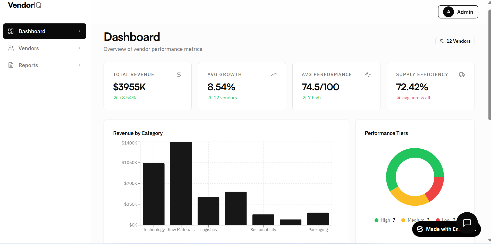

# VendorIQ – AI Vendor Intelligence Platform

## Overview
VendorIQ is an AI-powered platform that analyzes vendor performance, predicts risks, and allows users to query insights using natural language.

## Live Demo
https://supply-intel-3.emergent.host

## Features
- Vendor Performance Dashboard (Revenue, Growth, Score)
- AI Insights (Strengths, Risks, Opportunities)
- Vendor Risk Predictor (Low / Medium / High)
- Conversational AI Assistant
- Admin Login

## Sample Credentials
Email: admin@vendorpro.com  
Password: admin123

## Problem Solved
Traditional vendor management systems rely heavily on manual reporting and lack predictive insights. VendorIQ introduces AI-driven analytics and decision support.

## My Role
- Identified real-world vendor management challenges
- Designed end-to-end AI product solution
- Built and deployed working prototype
- Implemented AI-based insights, risk prediction, and chat interface

## Screenshots

### Dashboard

### AI Chat

### Risk Prediction

## Tech Stack
- No-code AI platform (Emergent)
- AI model integration
- Web-based dashboard

## Future Enhancements
- Multi-user roles
- Export reports
- Advanced analytics
